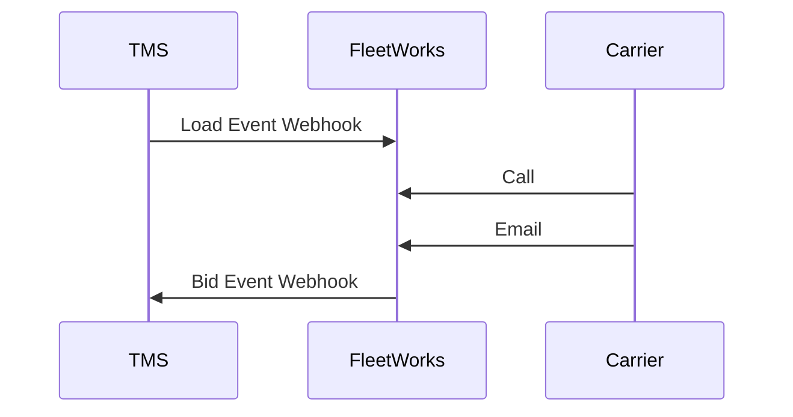

## Overview

FleetWorks is an AI-powered freight logistics platform that automates carrier communications and transactions. 

Our platform integrates with your Transportation Management System (TMS) and compliance providers to vet carriers, relay load information, negotiate rates, and book loads. 

Through automated phone and email communications, our AI agents handle the entire workflow from carrier outreach to rate confirmation, while seamlessly syncing all updates with your TMS in real-time.

## How It Works

While your TMS sends load information to FleetWorks through webhooks, our system will feed offers and book loads through your system.

## Getting Started

To integrate with FleetWorks:

1. We'll provide you with a bearer token to authenticate your requests.
2. Configure your TMS to send event webhooks to FleetWorks.
   - [Load Events](/api-reference/ingestion/load-events-webhook)
   - [Carrier Events](/api-reference/ingestion/carrier-events-webhook)
3. Configure your TMS to receive event webhooks from FleetWorks.
   - [Bid Events](/events/bids)

Detailed endpoint specifications and payload examples can be found in the API Reference section.
