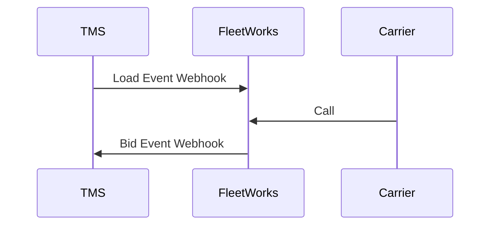

## Overview

FleetWorks is an AI-powered freight logistics platform that automates carrier sales communications. Our platform connects with your TMS through webhooks, allowing us to provide load details and receive bids through our AI phone+email systems.

## How It Works

While your TMS sends load information to FleetWorks through webhooks, our system will feed offers and book loads through your system.

## Getting Started

To integrate with FleetWorks:

1. We'll provide you with a bearer token to authenticate your requests.
2. Configure your TMS to send event webhooks to FleetWorks.
   - [Load Events](/api-reference/ingestion/load-events-webhook)
   - [Carrier Events](/api-reference/ingestion/carrier-events-webhook)
3. Configure your TMS to receive event webhooks from FleetWorks.
   - [Bid Events](/api-reference/outbound-webhooks/bid-events-webhook)

Detailed endpoint specifications and payload examples can be found in the API Reference section.
