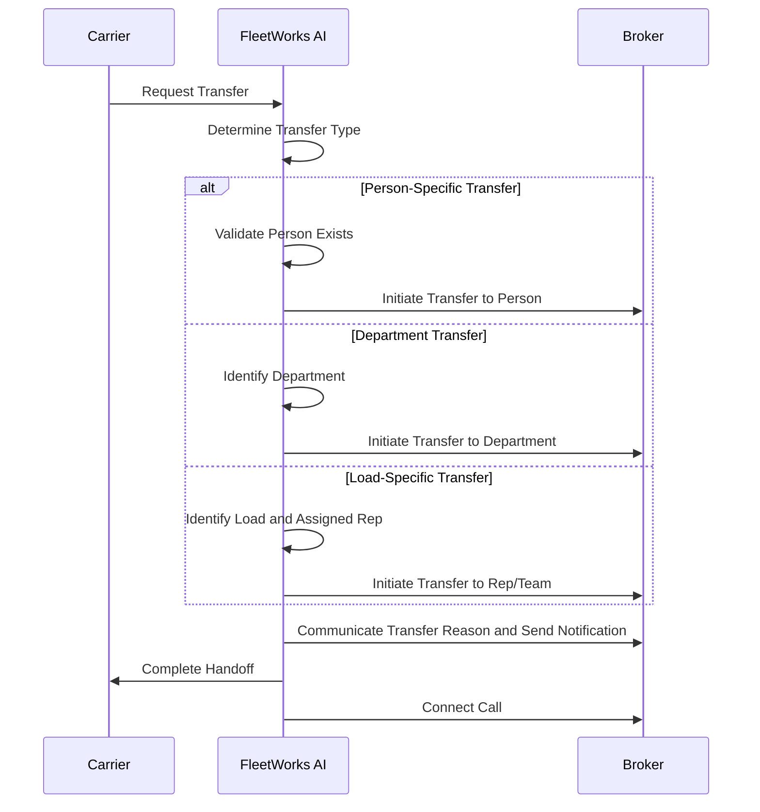

The FleetWorks AI agent is equipped to handle various transfer scenarios intelligently during carrier conversations:

### Person-Specific Transfers
When a carrier requests to speak with a specific person (e.g., "Can I talk to John Smith?"), the agent:
- Recognizes the named individual
- Validates if the person exists in the system
- Initiates a direct transfer to that person's extension

### Department/General Line Transfers 
The agent can identify when a carrier needs to be transferred to general departments like:
- Accounting
- Claims
- Dispatch

### Load-Specific Transfers
For load-related inquiries, the agent:
- Identifies the specific load being discussed
- Determines the assigned carrier sales representative or team
- Routes the call to the appropriate rep or team handling that load

When the transfer happens, the agent communicates the reason for transfer and relevant details to the intended recipient to create a smooth handoff experience before connecting the parties.

